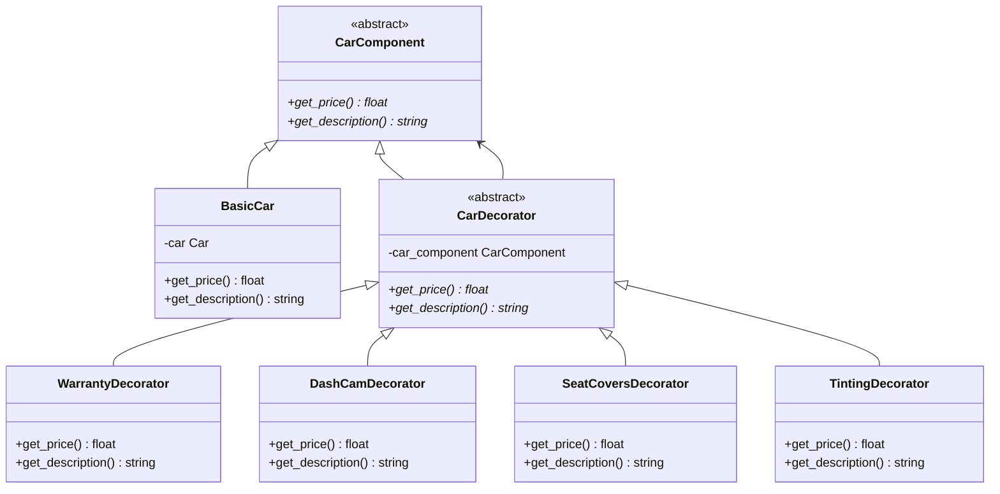

# CAR Hub

A car selling website built with Django and MySQL, implimenting 7 software design patterns made for Software Engineering Course(CSE327) under Supervisor AKM Iqtidar Newaz(IQN).

## Setup

1.  Install dependencies:
    ```bash
    pip install django mysqlclient
    ```
2.  Configure Database:
    *   The project is configured to use SQLite by default for development ease.
    *   To use MySQL, ensure you have a database named `car_hub_db` and set the `USE_MYSQL=True` environment variable, or edit `car_hub/settings.py`.
3.  Run Migrations:
    ```bash
    python manage.py migrate
    ```
4.  Create Superuser (Admin):
    ```bash
    python manage.py createsuperuser
    ```
5.  Run Server:
    ```bash
    python manage.py runserver
    ```
6. Superuser/Admin creation
    ```bash
    python3 manage.py createsuperuser
    ```
***

## Quick Start (How to Run the Project)

To start the project, follow these simple steps:

1. **Navigate to the project directory:**
   ```bash
   cd /home/safat/VS_Code/CAR_Hub
   ```

2. **Start the development server:**
   ```bash
   python3 manage.py runserver
   ```

3. **Access the application:**
   - Open your browser and go to: `http://127.0.0.1:8000/`
   - You'll see the welcome page if you're not logged in
   - Login or signup to access the car listings

4. **Stop the server:**
   - Press `CTRL + C` in the terminal

***

## Design Patterns Implemented

1.  **Factory Design Pattern**: Used to create different types of cars (Sedan, SUV, Truck, Coupe).
    *   Location: `cars/patterns/factory.py`
    *   Usage: `views.py` -> `create_car`
2.  **Singleton Design Pattern**: Used for Database Configuration Manager.
    *   Location: `cars/patterns/singleton.py`
    *   Usage: `views.py` -> `home`
3.  **Observer Pattern**: Used for notifications.
    *   Location: `cars/patterns/observer.py`
    *   Usage: `views.py` -> `update_price`
4.  **Strategy Design Pattern**: Used for search and filtering (Price, Brand, Mileage).
    *   Location: `cars/patterns/strategy.py`
    *   Usage: `views.py` -> `home`
5.  **Decorator Design Pattern**: Used for optional add-ons (Extended Warranty, Added Dash Cam, Custom Seat Covers, Window Tinting).
    *   Location: `cars/patterns/decorator.py`
    *   Usage: `views.py` -> `car_detail`
6.  **Proxy Design Pattern**: Used for access control (Approving car listing).
    *   Location: `cars/patterns/proxy.py`
    *   Usage: `views.py` -> `create_car`, `delete_car`
7. **Adapter Design Pattern**: Used for converting the currency in price of car and other add-ons
    *   Location: `cars/patterns/adapter.py`
    *   Usage: `views.py` -> `car_detail`


## ERD


## Class Diagrams

### Django Models


### Factory Pattern


### Singleton Pattern


### Strategy Pattern


### Decorator Pattern


### Observer Pattern


### Proxy Pattern


### Adapter Pattern


## Sequence Diagram

### Car Purchase Flow


### Car Listing Creation Flow


### Price Update and Notification Flow


### Search and Filter Flow
